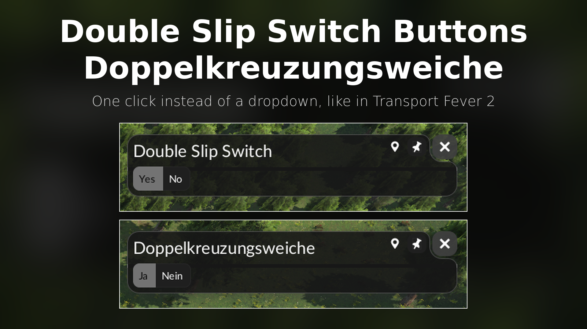

# Double Slip Switch Button / Doppelkreuzweiche Knof

A Transport Fever 3 mod that replaces the Yes/No dropdown of the double slip switch window with two buttons.

When you click a track crossing, the game opens the **"Double Slip Switch"** window with a dropdown holding the two entries "Yes" and "No". With this mod the window shows two directly clickable buttons instead, as in Transport Fever 2. One click switches the crossing between a plain diamond crossing and a double slip switch; the active state is highlighted.

## Installation

- **mod.io / in-game Mod Hub:** subscribe to "Double Slip Switch Button / Doppelkreuzweiche Knof" and enable it for your game.
- **Manual:** copy the `doppelkreuzweiche_1` folder into your mods folder and restart the game:
  - Linux: `~/.local/share/Transport Fever 3/mods/`
  - Windows: the `mods` folder inside the Transport Fever 3 userdata directory

Pure UI mod: it can be added to or removed from a savegame at any time.

## How it works

The mod registers a `react-replacement-config` resource and replaces the game's recipe for the window content (`gui/entity_window/double_slip_switch.tl`) with one that uses the game's own `ToggleButtonGroup`. The command sent on click is the same as in the original. The button labels are the game's own "Yes"/"No" strings, so they follow the game language.

For crossings that also offer the traffic light configuration, the original window content is shown unchanged.

## Development

- Start the game in debug mode to get the in-game console (open it with `^`).
- Changes to `*.res.lua` need a game restart; scripts hot-reload with `AltGr+Shift+R`.
- Errors are logged with the prefix `DOPPELKREUZWEICHE` to `crash_dump/stdout.txt` in the game's userdata folder.

## License

MIT, see [LICENSE](LICENSE).

---

## Deutsch

**Doppelkreuzungsweiche: Ja/Nein** ersetzt im Fenster „Doppelkreuzungsweiche“ einer Gleiskreuzung das Dropdown mit „Ja“ und „Nein“ durch zwei direkt klickbare Buttons, wie in Transport Fever 2. Ein Klick schaltet zwischen einfacher Kreuzung und Doppelkreuzungsweiche (DKW) um, der aktive Zustand ist hervorgehoben.

Installation über mod.io bzw. den Mod Hub im Spiel, oder manuell den Ordner `doppelkreuzweiche_1` nach `~/.local/share/Transport Fever 3/mods/` (Linux) bzw. in den `mods`-Ordner der Userdata (Windows) kopieren und das Spiel neu starten.

Reine UI-Mod: kann jederzeit zu einem Spielstand hinzugefügt oder entfernt werden. Die Beschriftung der Buttons kommt aus dem Spiel und folgt der Spielsprache. Bei Kreuzungen mit Ampel-Konfiguration bleibt der Fensterinhalt unverändert.
